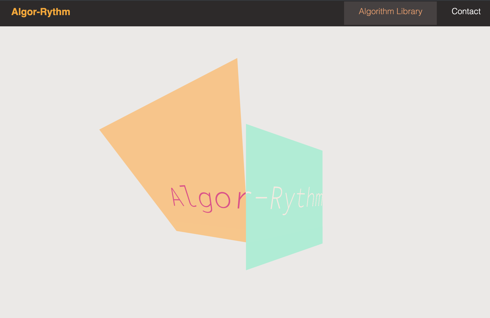
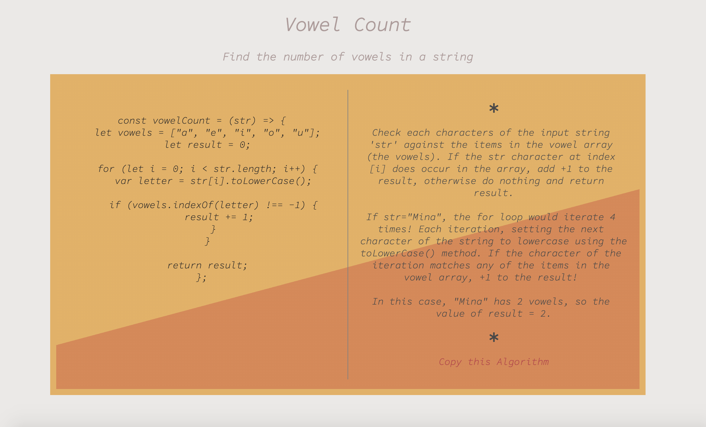

Deployed Link: https://shelbypalumbo.github.io/Algor-Rythm/

# User Story

As I build my knowledge of algorithms, I want to showcase my notes in a visually appealing way, so that I can refer back to my notes and feel inspired.

# Usage

A React application showcasing a library of algorithms with examples, explanations, and an option to copy the algorithm to your clipboard! Use the search bar to narrow down the type of algorithm you are looking for.

## Work in Progress

- Continue adding more algorithms
- Add search and sort functionality to search for keywords not the full algorithm titles
- Contact page content
- Reverse order of mobile nav dropdown menu

### Programming Languages Used

- React
- JSX
- HTML
- CSS

### Additional Styling Framework

- Fontsawesome icons | https://fontawesome.com/icons?d=gallery&m=free

- Google Fonts | https://fonts.google.com/?selection.family=Odibee+Sans

#### Other Resources

- Reusable Button Component by graysonhicks| https://github.com/graysonhicks/react-scrolltop-button
